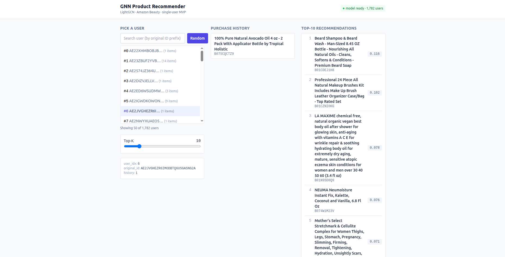

# GNN Product Recommender

LightGCN 기반 상품 추천 시스템입니다. Amazon Beauty 데이터셋으로 사용자-아이템 이분(bipartite) 그래프를 학습하고, **FastAPI + React** 단일 포트 웹앱에서 추천 결과를 확인할 수 있습니다.



> 사용자를 검색/선택(좌) → 학습 데이터의 구매 이력(중) → 마스킹된 Top-K 추천(우). 우상단에 모델 로드 상태와 사용자 수가 표시됩니다.

## Highlights

- **모델**: [LightGCN](https://arxiv.org/abs/2002.02126) — PyTorch Geometric 내장 구현 (3-layer GCN, 64-dim)
- **학습**: BPR(Bayesian Personalized Ranking) + L2, 벡터화된 GPU 음성 샘플링, Early Stopping, `ReduceLROnPlateau`
- **평가**: HR@K, NDCG@K (Full-ranking, train 이력 마스킹)
- **서빙**: FastAPI + 모듈 싱글톤 상태 + 부팅 시 임베딩 precompute (요청당 `O(num_items)` 내적 1회 + topk)
- **프런트**: Vite + React 18 + TypeScript + TanStack Query + Tailwind 3.4
- **단일 포트**: dev 는 Vite proxy, prod 는 FastAPI 가 SPA + API 동시 서빙

## Architecture

```
User ──┐                     ┌── Embedding Layer
       ├─ Bipartite Graph ─► LightGCN (3-layer GCN) ─► User/Item Embeddings ─► Inner Product ─► Top-K
Item ──┘                     └── Message Passing
```

### Runtime topology (single-port)

```
dev:   browser → Vite (5173) ──/api/*──► FastAPI (8000)
prod:  browser → FastAPI (8000) ── /api/*      → APIRouter
                                  └─ /, /*    → frontend/dist (StaticFiles + SPA fallback)
```

더 자세한 아키텍처 / 데이터 흐름 / 클래스 · 시퀀스 다이어그램은 다음 문서를 참고하세요.

- [docs/architecture.md](docs/architecture.md) — 레이어, 컴포넌트 책임, 라이프사이클, 트레이드오프
- [docs/uml.md](docs/uml.md) — Mermaid 기반 컴포넌트/클래스/시퀀스/상태/배포 다이어그램

## Project Structure

```
gnn-recommender/
├── backend/                # FastAPI 서비스 + 학습 파이프라인 (Python 3.10)
│   ├── api/
│   │   ├── main.py         # FastAPI app, lifespan, SPA 정적 마운트
│   │   ├── routes.py       # /api/* 엔드포인트 (얇은 컨트롤러)
│   │   ├── schemas.py      # Pydantic 응답 모델
│   │   └── service.py      # 모델/임베딩 로드 + 추천 로직 (모듈 싱글톤)
│   ├── config.py           # 하이퍼파라미터, 시드, 로깅
│   ├── data.py             # 데이터 다운로드 / 전처리 / 그래프 구성
│   ├── model.py            # LightGCN 생성, 체크포인트 저장/로드
│   ├── train.py            # BPR 학습 루프, Early Stopping, LR Scheduler
│   ├── evaluate.py         # HR@K, NDCG@K Full-ranking 평가
│   ├── app_gradio.py       # (LEGACY) Gradio 데모 — 신규 기능 추가 금지
│   ├── run.py              # CLI: 데이터 → 학습 (서빙은 uvicorn 으로 분리)
│   ├── requirements.txt
│   └── data/               # gitignored: raw / processed / checkpoints
├── frontend/               # Vite + React + TS + Tailwind 3.4 (Node 18)
│   ├── src/
│   │   ├── api/
│   │   │   ├── client.ts   # fetch 래퍼 + DTO 타입
│   │   │   └── types.ts    # OpenAPI 로 생성 (npm run typegen)
│   │   ├── components/     # UserPicker / HistoryList / RecommendationList
│   │   ├── App.tsx         # 3-컬럼 레이아웃 + Top-K 슬라이더 + health 폴링
│   │   └── main.tsx        # QueryClientProvider 마운트
│   ├── vite.config.ts      # /api → 127.0.0.1:8000 프록시
│   ├── tailwind.config.js
│   └── package.json
├── package.json            # 루트 concurrently 러너 (npm run dev)
├── docs/
│   ├── architecture.md
│   ├── uml.md
│   └── gradio_demo.png     # 레거시 Gradio 데모 스크린샷
├── demo.png                # 현재 React UI 스크린샷
└── README.md
```

## Setup

**Prerequisites**

- Python 3.10 (예: miniconda env `py310_pt`) + (선택) CUDA — 학습용
- Node 18.x (예: `18.20.8` — `.nvmrc` 참조), npm ≥ 9

```bash
# 백엔드
cd backend
pip install -r requirements.txt

# 프런트엔드
cd ../frontend
npm install

# 루트 (concurrently 등)
cd ..
npm install
```

PyTorch Geometric 은 PyTorch 버전에 맞춰 별도 설치가 필요할 수 있습니다. [공식 설치 가이드](https://pytorch-geometric.readthedocs.io/en/latest/install/installation.html) 참조.

## Usage

### Dev — 백엔드 + 프런트엔드 동시 실행

루트에서:

```bash
npm run dev           # FastAPI(8000) + Vite(5173) 동시 기동 (concurrently)
```

브라우저로 http://127.0.0.1:5173 접속.

세부 명령:

```bash
npm run dev:api       # uvicorn api.main:app --reload (8000)
npm run dev:web       # vite (5173)
```

### 학습

```bash
cd backend
python run.py                     # 전체 파이프라인 (데이터 → 학습)
python run.py --skip-train        # 데이터 전처리만 (캐시 생성)
python run.py --resume            # 마지막 체크포인트에서 재개
python run.py --epochs 50         # epoch 오버라이드
python run.py --legacy-gradio     # (deprecated) Gradio 데모 실행
```

학습이 끝나면 `backend/data/checkpoints/best_model.pt` 가 생성되며, 이 체크포인트가 FastAPI 부팅 시 자동 로드됩니다.

### 프로덕션 빌드 + 단일 포트 서빙

```bash
npm run build:web                 # frontend/dist 생성
npm run serve                     # FastAPI 가 8000 에서 SPA + API 동시 서빙
```

빌드된 `frontend/dist` 가 존재할 때만 `api/main.py` 가 StaticFiles 와 SPA fallback 을 등록합니다.

### OpenAPI → TypeScript 타입 재생성

백엔드가 떠 있는 상태에서:

```bash
npm run typegen                   # frontend/src/api/types.ts 갱신
```

백엔드 스키마(`backend/api/schemas.py`) 변경 시 TS 컴파일 에러로 누락된 동기화를 즉시 발견할 수 있습니다.

### CLI Options (`run.py`)

| Option | Description |
|---|---|
| `--skip-train` | 학습을 건너뛰고 데이터 전처리만 수행 |
| `--epochs N` | 학습 epoch 수 오버라이드 |
| `--train-only` | 학습만 수행 (기본 동작과 동일) |
| `--resume` | `last_model.pt` 에서 학습 재개 |
| `--legacy-gradio` | (deprecated) 레거시 Gradio 데모 실행 |

## REST API

| Method | Path | Response | 비고 |
|---|---|---|---|
| GET | `/api/health` | `Health` | `model_loaded=true` 면 서비스 준비 완료 |
| GET | `/api/users?limit&offset&q` | `UserListOut` | 학습 이력 보유 사용자 풀에서 필터 |
| GET | `/api/users/random` | `UserOut` | 랜덤 1명 |
| GET | `/api/users/{user_idx}` | `UserOut` | 범위 밖이면 404 |
| GET | `/api/users/{user_idx}/history?limit` | `ItemOut[]` | 학습 데이터 이력 |
| GET | `/api/users/{user_idx}/recommendations?k` | `RecommendationOut[]` | 학습 이력 마스킹된 Top-K |

OpenAPI 명세는 dev 환경에서 http://127.0.0.1:8000/docs (또는 `/redoc`) 으로 확인할 수 있습니다. 프로덕션에서는 `DISABLE_DOCS=1` 환경변수로 비활성화 가능합니다.

## Configuration

`backend/config.py` 의 `Config` dataclass 에서 주요 하이퍼파라미터를 조정할 수 있습니다.

| Parameter | Default | Description |
|---|---|---|
| `embedding_dim` | 64 | 임베딩 차원 |
| `num_layers` | 3 | GCN 레이어 수 |
| `lr` | 1e-3 | 학습률 |
| `lambda_reg` | 1e-4 | L2 정규화 계수 |
| `batch_size` | 4096 | 미니배치 크기 |
| `epochs` | 200 | 최대 학습 epoch |
| `early_stop_patience` | 20 | Early Stopping patience (raw epochs) |
| `eval_every` | 5 | 평가 주기 (epoch) |
| `lr_scheduler_patience` | 10 | LR Scheduler patience |
| `lr_scheduler_factor` | 0.5 | LR 감쇠율 |
| `min_interactions` | 3 | K-core 필터링 최소 상호작용 수 |
| `rating_threshold` | 3.0 | Positive interaction 기준 평점 |
| `seed` | 42 | 랜덤 시드 (재현성) |

## Dataset

[McAuley-Lab/Amazon-Reviews-2023](https://huggingface.co/datasets/McAuley-Lab/Amazon-Reviews-2023) 의 **All Beauty** 카테고리를 사용합니다. 스킨케어, 헤어케어, 메이크업 등의 뷰티 상품 리뷰 데이터입니다.

### 원본 데이터

HuggingFace Hub 에서 2종의 파일을 자동 다운로드합니다.

**리뷰 데이터** (`All_Beauty.jsonl`)

| 필드 | 설명 |
|---|---|
| `user_id` | 사용자 고유 ID |
| `parent_asin` | 상품 고유 ID (ASIN) |
| `rating` | 평점 (1.0 ~ 5.0) |
| `timestamp` | 리뷰 작성 시간 (UNIX timestamp) |

**메타데이터** (`raw_meta_All_Beauty.parquet`)

| 필드 | 설명 |
|---|---|
| `parent_asin` | 상품 고유 ID (ASIN) |
| `title` | 상품명 (데모 UI 표시용) |

### 전처리 파이프라인

```
Raw reviews → Positive 필터링 → K-core 필터링 → ID 매핑 → Leave-one-out Split → Graph 구성
```

1. **Positive 필터링**: `rating >= 3.0` 인 상호작용만 유지 (암시적 선호 신호로 변환)
2. **K-core 필터링**: 유저/아이템 모두 최소 3회 이상 상호작용이 있어야 유지 (수렴할 때까지 반복)
3. **ID 매핑**: 유저/아이템을 연속 정수 ID 로 변환. 아이템 ID 는 `num_users` 만큼 오프셋 적용하여 하나의 bipartite 그래프 노드 공간으로 통합
4. **Leave-one-out Split**: 유저별 시간순 정렬 후 마지막 1개 = test, 그 직전 1개 = validation, 나머지 = train
5. **그래프 구성**: train 데이터로 undirected bipartite 그래프 구성 (양방향 엣지)
6. **캐싱**: 전처리 결과를 `data/processed/data.pt` 에 캐시 (재실행 시 다운로드/전처리 생략)

### 전처리 후 규모 (참고)

| 항목 | 수치 |
|---|---|
| Users | 1,782 |
| Items | 1,944 |
| Graph nodes | 3,726 |
| Val / Test | 유저당 각 1개 |

## License

[MIT](LICENSE)
