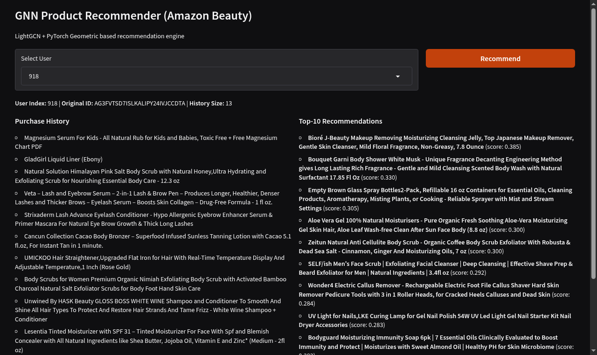

# GNN Product Recommender

LightGCN 기반 상품 추천 시스템입니다. Amazon Beauty 데이터셋을 활용하여 사용자-아이템 상호작용 그래프를 학습하고, Gradio 웹 데모를 통해 추천 결과를 확인할 수 있습니다.

## Demo



사용자를 선택하고 Recommend 버튼을 클릭하면, 구매 이력(좌)과 Top-10 추천 결과(우)를 확인할 수 있습니다.

## Architecture

```
User ──┐                     ┌── Embedding Layer
       ├─ Bipartite Graph ─► LightGCN (3-layer GCN) ─► User/Item Embeddings ─► Inner Product ─► Top-K
Item ──┘                     └── Message Passing
```

- **Model**: [LightGCN](https://arxiv.org/abs/2002.02126) (PyTorch Geometric 내장 구현)
- **Loss**: BPR (Bayesian Personalized Ranking) + L2 Regularization
- **Evaluation**: HR@K, NDCG@K (Full-ranking protocol)

## Project Structure

```
gnn-recommender/
├── config.py       # 하이퍼파라미터, 시드 고정, 로깅 설정
├── data.py         # 데이터 다운로드, 전처리, 그래프 구성
├── model.py        # LightGCN 모델 생성, 체크포인트 저장/로드
├── train.py        # BPR 학습 루프, Early Stopping, LR Scheduler
├── evaluate.py     # HR@K, NDCG@K 평가
├── app.py          # Gradio 웹 데모
├── run.py          # End-to-end 파이프라인 (데이터 → 학습 → 데모)
└── requirements.txt
```

## Setup

```bash
pip install -r requirements.txt
```

PyTorch Geometric은 PyTorch 버전에 맞춰 별도 설치가 필요할 수 있습니다. [공식 설치 가이드](https://pytorch-geometric.readthedocs.io/en/latest/install/installation.html)를 참고하세요.

## Usage

### Full Pipeline (데이터 다운로드 + 학습 + 데모)

```bash
python run.py
```

### 개별 실행

```bash
# 데이터 전처리만
python data.py

# 학습만
python run.py --train-only

# 학습 epoch 지정
python run.py --train-only --epochs 50

# 중단된 학습 재개
python run.py --train-only --resume

# 기존 체크포인트로 데모만
python run.py --demo-only
```

### CLI Options

| Option | Description |
|---|---|
| `--skip-train` | 학습을 건너뛰고 기존 체크포인트 사용 |
| `--epochs N` | 학습 epoch 수 오버라이드 |
| `--train-only` | 학습만 수행, 데모 미실행 |
| `--demo-only` | 데모만 실행 |
| `--resume` | 마지막 체크포인트에서 학습 재개 |

## Configuration

`config.py`의 `Config` 클래스에서 주요 하이퍼파라미터를 조정할 수 있습니다.

| Parameter | Default | Description |
|---|---|---|
| `embedding_dim` | 64 | 임베딩 차원 |
| `num_layers` | 3 | GCN 레이어 수 |
| `lr` | 1e-3 | 학습률 |
| `lambda_reg` | 1e-4 | L2 정규화 계수 |
| `batch_size` | 4096 | 미니배치 크기 |
| `epochs` | 200 | 최대 학습 epoch |
| `early_stop_patience` | 20 | Early Stopping patience |
| `min_interactions` | 3 | K-core 필터링 최소 상호작용 수 |
| `rating_threshold` | 3.0 | Positive interaction 기준 평점 |
| `seed` | 42 | 랜덤 시드 (재현성) |

## Dataset

[McAuley-Lab/Amazon-Reviews-2023](https://huggingface.co/datasets/McAuley-Lab/Amazon-Reviews-2023)의 **All Beauty** 카테고리를 사용합니다. 스킨케어, 헤어케어, 메이크업 등의 뷰티 상품 리뷰 데이터입니다.

### 원본 데이터

HuggingFace Hub에서 2종의 파일을 자동 다운로드합니다.

**리뷰 데이터** (`All_Beauty.jsonl`)

| 필드 | 설명 |
|---|---|
| `user_id` | 사용자 고유 ID |
| `parent_asin` | 상품 고유 ID (ASIN) |
| `rating` | 평점 (1.0 ~ 5.0) |
| `timestamp` | 리뷰 작성 시간 (UNIX timestamp) |

**메타데이터** (`raw_meta_All_Beauty.parquet`)

| 필드 | 설명 |
|---|---|
| `parent_asin` | 상품 고유 ID (ASIN) |
| `title` | 상품명 (데모 UI 표시용) |

### 전처리 파이프라인

```
Raw reviews → Positive 필터링 → K-core 필터링 → ID 매핑 → Leave-one-out Split → Graph 구성
```

1. **Positive 필터링**: `rating >= 3.0`인 상호작용만 유지 (암시적 선호 신호로 변환)
2. **K-core 필터링**: 유저와 아이템 모두 최소 3회 이상 상호작용이 있어야 유지 (수렴할 때까지 반복)
3. **ID 매핑**: 유저/아이템을 연속 정수 ID로 변환. 아이템 ID는 `num_users`만큼 오프셋 적용하여 하나의 bipartite 그래프 노드 공간으로 통합
4. **Leave-one-out Split**: 유저별 시간순 정렬 후 마지막 1개 = test, 그 직전 1개 = validation, 나머지 = train
5. **그래프 구성**: train 데이터로 undirected bipartite 그래프 구성 (양방향 엣지)
6. **캐싱**: 전처리 결과를 `data/processed/data.pt`에 캐시 (재실행 시 다운로드/전처리 생략)

### 전처리 후 규모

| 항목 | 수치 |
|---|---|
| Users | 1,782 |
| Items | 1,944 |
| Graph nodes | 3,726 |
| Val / Test | 유저당 각 1개 |
