# UML Diagrams

> GNN Product Recommender — UML 다이어그램 모음

본 문서의 모든 다이어그램은 [Mermaid](https://mermaid.js.org/) 문법으로 작성되었습니다. GitHub, VS Code(Mermaid 확장), IntelliJ 등에서 바로 렌더링됩니다.
시스템 개요는 [`architecture.md`](./architecture.md) 를 참고하세요.

목차:
1. [컴포넌트 다이어그램](#1-컴포넌트-다이어그램)
2. [패키지 다이어그램](#2-패키지-다이어그램)
3. [백엔드 클래스 다이어그램](#3-백엔드-클래스-다이어그램)
4. [프런트엔드 클래스/컴포넌트 다이어그램](#4-프런트엔드-클래스컴포넌트-다이어그램)
5. [DTO / 데이터 모델 다이어그램](#5-dto--데이터-모델-다이어그램)
6. [시퀀스 다이어그램 — 추천 요청](#6-시퀀스-다이어그램--추천-요청)
7. [시퀀스 다이어그램 — 서버 부팅 / 모델 로드](#7-시퀀스-다이어그램--서버-부팅--모델-로드)
8. [시퀀스 다이어그램 — 학습 파이프라인](#8-시퀀스-다이어그램--학습-파이프라인)
9. [시퀀스 다이어그램 — 평가 루프](#9-시퀀스-다이어그램--평가-루프)
10. [활동 다이어그램 — 데이터 전처리](#10-활동-다이어그램--데이터-전처리)
11. [상태 다이어그램 — 학습 사이클](#11-상태-다이어그램--학습-사이클)
12. [배포 다이어그램](#12-배포-다이어그램)

---

## 1. 컴포넌트 다이어그램

런타임 컴포넌트와 의존성. 단일 포트(single-port) 토폴로지를 보여줍니다.

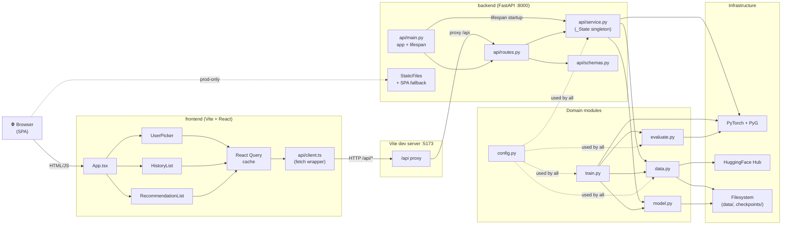

---

## 2. 패키지 다이어그램

코드 베이스의 모듈/패키지 의존 그래프(점선은 동적/lazy import).

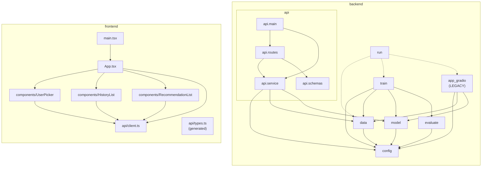

---

## 3. 백엔드 클래스 다이어그램

핵심 클래스/데이터클래스/모듈 단위 함수 그룹.

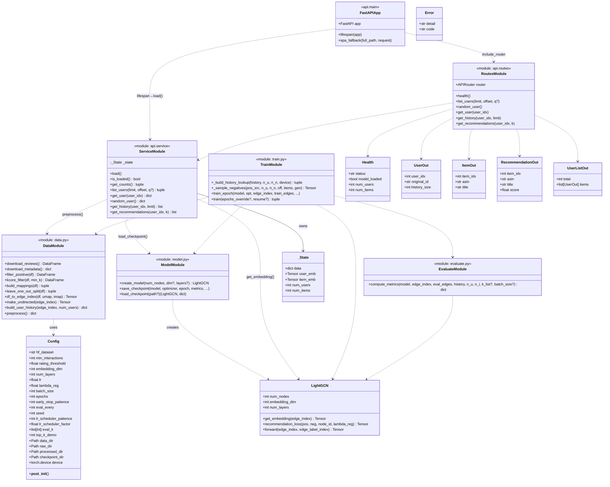

---

## 4. 프런트엔드 클래스/컴포넌트 다이어그램

React 컴포넌트 props, 외부 의존, API 메서드.

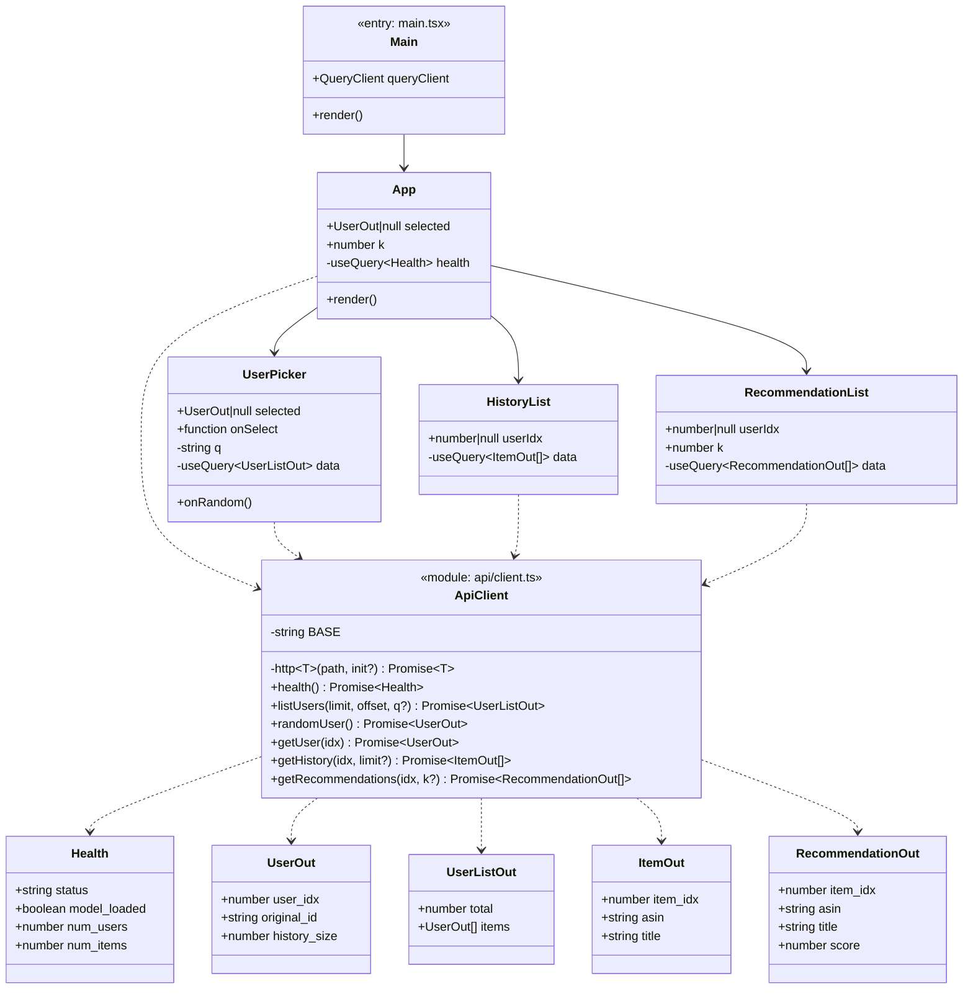

---

## 5. DTO / 데이터 모델 다이어그램

백엔드 Pydantic 모델과 프런트엔드 TS 인터페이스가 1:1 미러링됨을 보여줍니다.

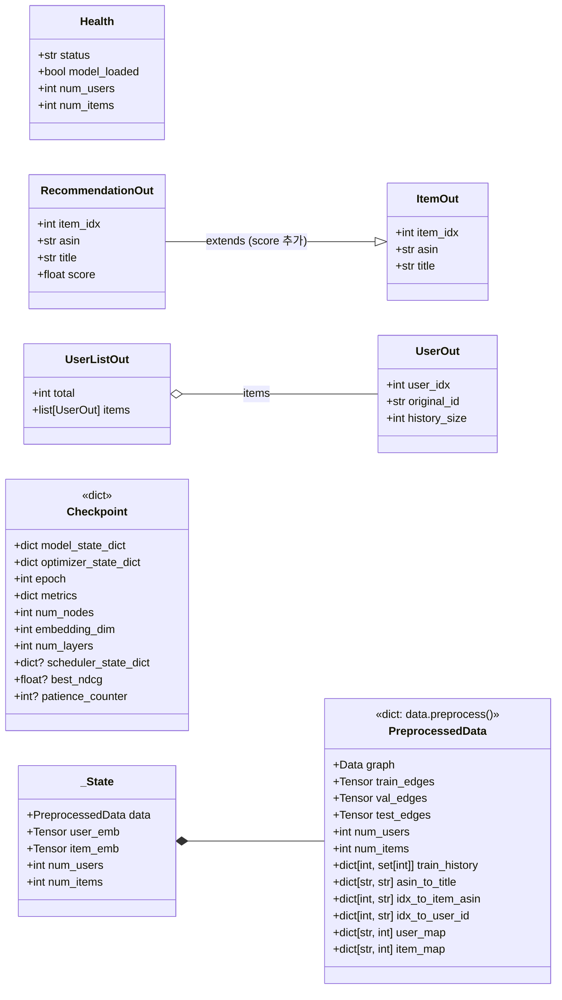

---

## 6. 시퀀스 다이어그램 — 추천 요청

사용자가 UserPicker 에서 한 명을 선택하면 발생하는 전체 호출 경로.

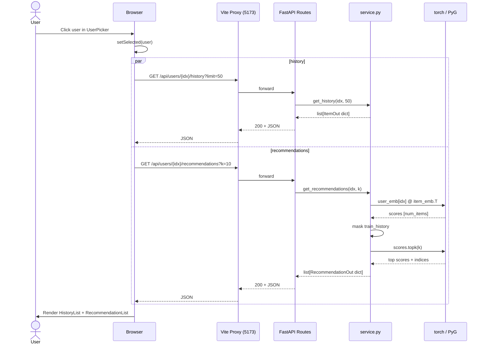

---

## 7. 시퀀스 다이어그램 — 서버 부팅 / 모델 로드

`uvicorn api.main:app` 부팅부터 첫 요청 준비까지.

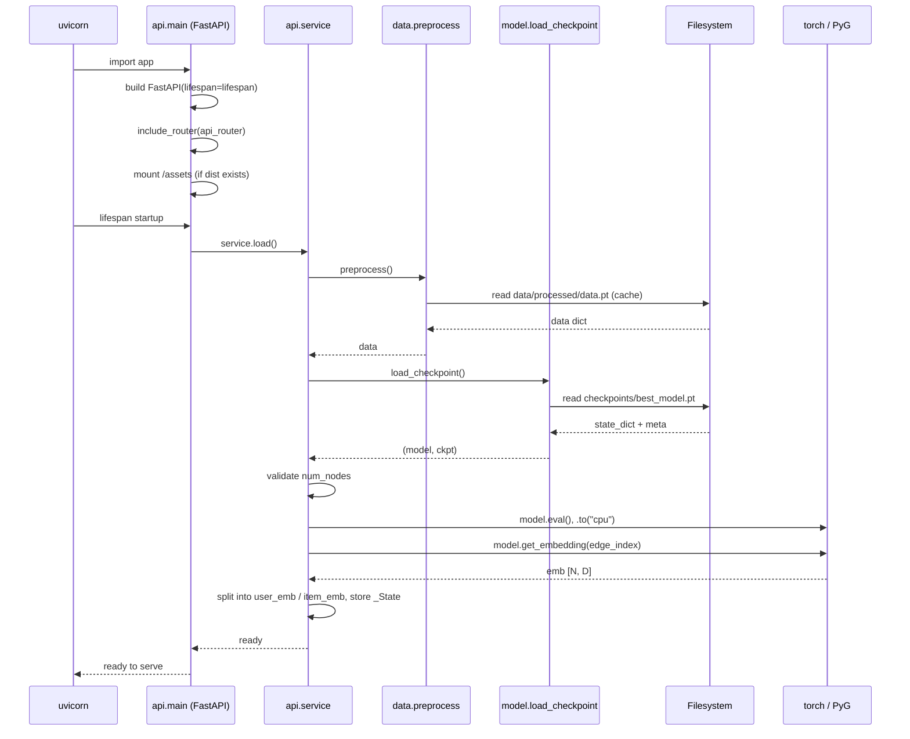

---

## 8. 시퀀스 다이어그램 — 학습 파이프라인

`python run.py` 가 부르는 전 과정.

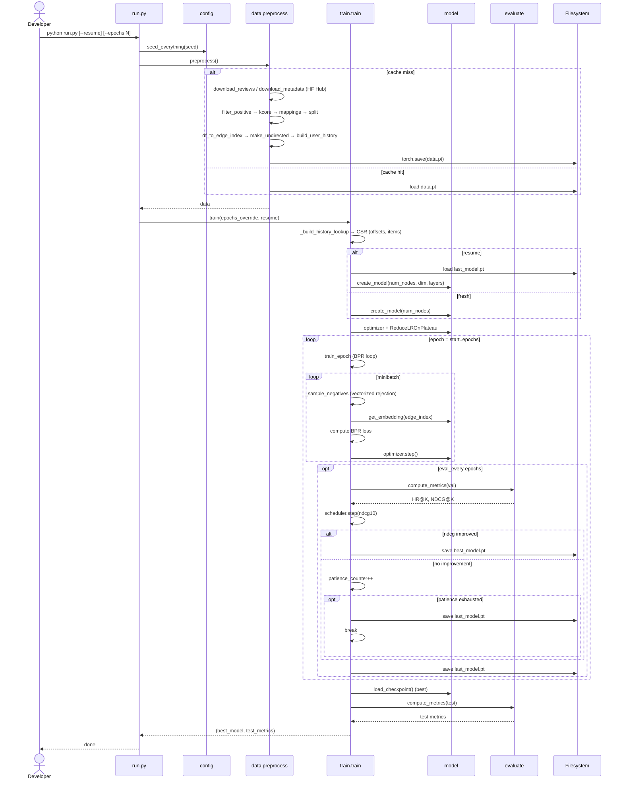

---

## 9. 시퀀스 다이어그램 — 평가 루프

`evaluate.compute_metrics` 의 내부 흐름.

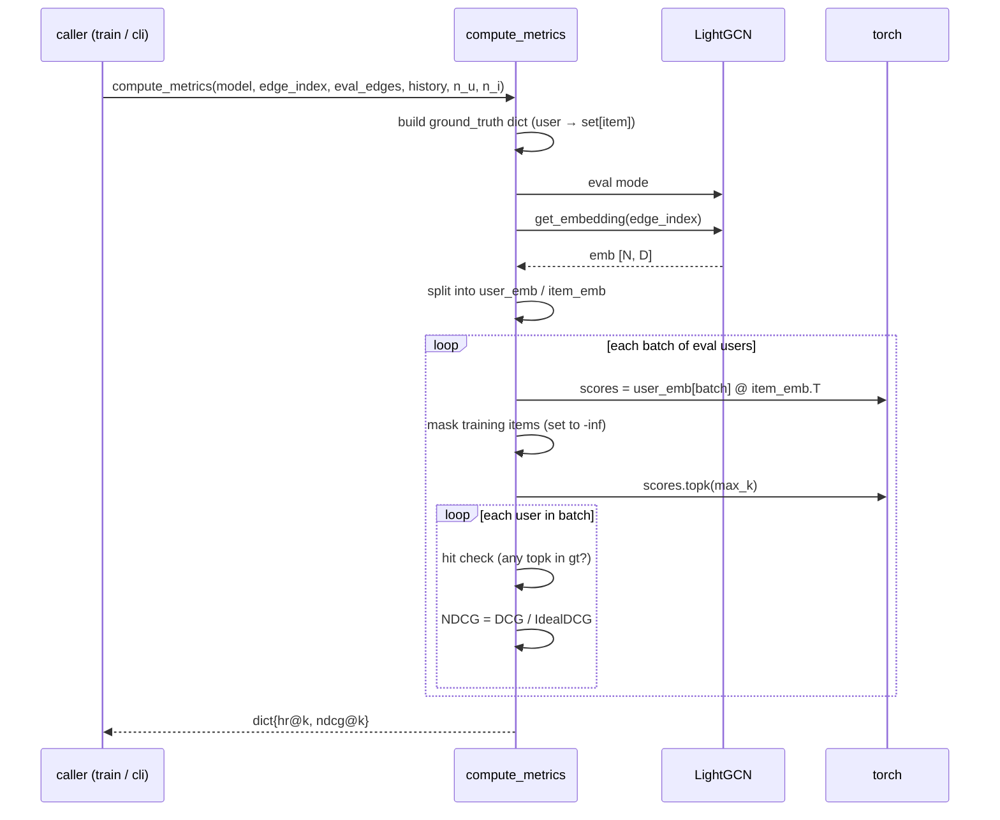

---

## 10. 활동 다이어그램 — 데이터 전처리

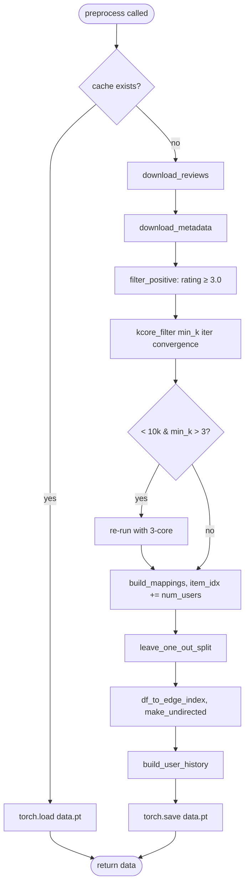

---

## 11. 상태 다이어그램 — 학습 사이클

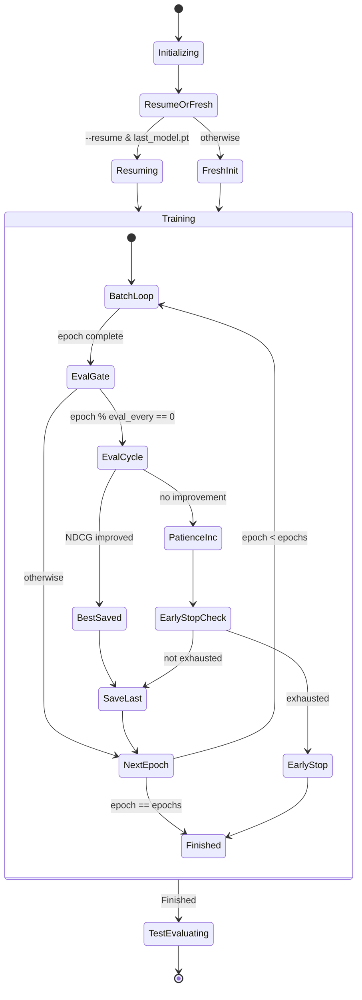

---

## 12. 배포 다이어그램

개발 / 프로덕션 토폴로지를 한 장으로 비교.

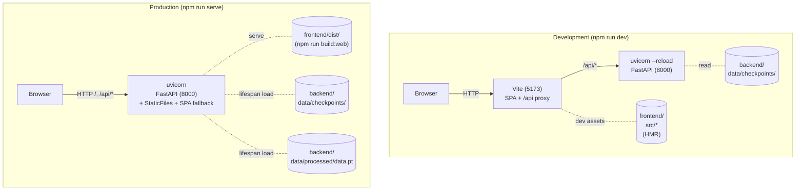

---

## 부록 — Mermaid 렌더링 팁

- **GitHub**: 자동 렌더링 (라이트/다크 모두).
- **VS Code**: `Markdown Preview Mermaid Support` 확장 설치.
- **JetBrains**: Markdown plugin 의 "Mermaid" 옵션을 활성화.
- **로컬 PNG/SVG 추출**: `npx @mermaid-js/mermaid-cli@latest -i uml.md -o out.svg` (코드블록 단위로 가능).
